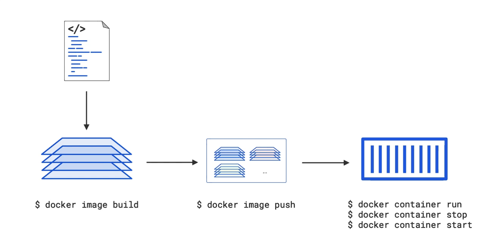
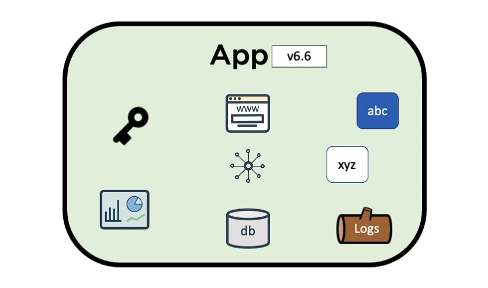
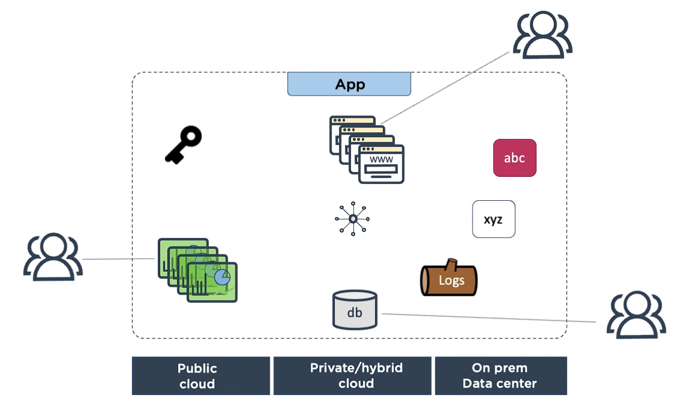
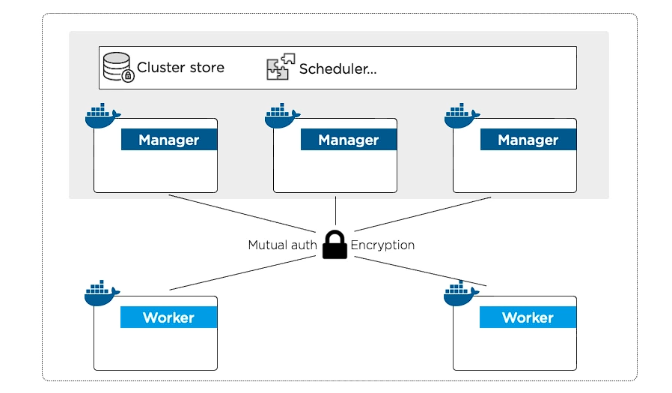
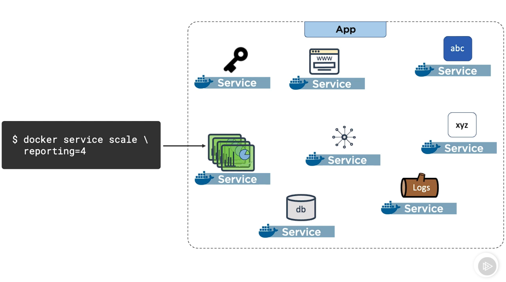

# Getting started with Docker

Clone the project to start working.  
`git clone https://github.com/nigelpoulton/gsd.git`

```docker
# Start building this image by getting the latest alpine-linux image for node.
# This is the alpine contains the node tools needs for a node application and
# we use this as the foundational layer or the bottom most layer of our application.
FROM node:current-alpine

LABEL org.opencontainers.image.title="Hello Docker Learners!" \
      org.opencontainers.image.description="Web server showing host that responded" \
      org.opencontainers.image.authors="@nigelpoulton"

# Create directory in container image for app code\
# -p: A flag which enables the command to create parent directories as necessary.
# If the directories exist, no error is specified. 
RUN mkdir -p /usr/src/app

# Copy app code (.) to /usr/src/app in container image
# Copy all the files and folders from wherever we run the build command.
COPY . /usr/src/app

# Set working directory context
WORKDIR /usr/src/app

# Install dependencies from packages.json
RUN npm install

# Command for container to execute
ENTRYPOINT [ "node", "app.js" ]
```

## Docker Image

Single file with all the required configurations and dependencies which is required to run a program.

## Docker Container

Docker container is a runnable instance of a docker image.

- Container is a sandboxed process on a machine and it is isolated from all other processes on host machine.
- Containers are isolated from each other and run their own Softwares, bins and configs.
- is portable (can run on any OS)
- runnable instance of an image, can create, update, delete, start, stop or move a container using the Docker API or CLI.
- can run on local machines, VMs or deployed to cloud.

**Note:** Images are build time constructs while containers are runtime constructs.

**Command to build a docker image:**

```docker
docker image build -t tomchi305/gsd:first-container .
```

- `-t` -> represents tag
- `tomchi305/gsd:first-container` -> **[docker-hub-id]:[name-of-the-repo-on-docker-hub]/[name-of-the-image]**
- . -> period tells docker that all the files needed, especially the dockerfile with build instruction, are in the directory that the command is ran from.

**List all the docker image:**

```docker
docker image ls
```

**Push the docker image to docker hub:**

```docker
docker image push tomchi305/gsd:first-container
```

**Remove docker image locally:**

```docker
docker image rm tomchi305/gsd:first-container
```

**To run detached container:**

```docker
docker container run -d --name web-poulton -p 8000:8080 tomchi305/gsd:first-container
```

- `-d` -> run the container in detached from the terminal, for the container to run in the background.
- `--name` -> assigning a name to the container, here it is `web-poulton`
- `-p 8000:8080` -> stands for `publish` Publish a container's port to the host. It says that bind port `8080` of the container to the port `8000` of the host machine.
  Explanation: Map port 8000 on the host (docker machine) to 8080, the port that the app is listening on in the container. Any traffic hitting port 8000 on local machine then docker will route it to port 8080 inside the container.
- `8000:8080` -> `[HOST_PORT]:[CONTAINER_PORT]`

**To stop a running container:**

Naming the container helps in stopping it by using the below command where we use the name.

```docker
docker container stop web-poulton
```

**List all the containers (stopped and running containers):**

```docker
docker container ls -a
```

**Start a stopped container:**

```docker
docker container start web-poulton
```

**To remove a container:**

In order to remove a container, we need to stop it first.

```docker
docker container rm web-poulton
```

**To run container with the terminal inside of it:**

```docker
docker container run -it --name test alpine sh
```

- `-it` -> interactive / inside terminal
- `alpine` -> small linux OS image
- `sh` -> main app inside the container to run, shell of the OS

shell is now attached directly inside the running container, if you run any command, it will run inside the container.

If `exit` is typed in the shell, it will stop the container as well since here using `exit` we are killing the shell process which is supposed to be the container's main process. So when `PID 1` process is killed in a container, the container basically tells itself my work is done and I will terminate now. **_Process ID 1 (PID 1) is usually the init process primarily responsible for starting and shutting down the system._** We donot want to stop the container.

In order to stop this situation, we use on `windows` -> <kbd>Ctrl</kbd> + <kbd>P</kbd> + <kbd>Q</kbd>

**To remove a running container forcefully:**

```docker
docker container rm test -f
```

### Small recap



### Cloud Native Microservices

In a monolith application, it's actually made up of lots of small features such as the web frontend, the data store, reporting, logging, is part of a single app, so it is deployed and managed as a large single unit, meaning, if you want to patch or push a feature update, you are patching the entire app, and that can sometimes mean taking the whole thing down while the patch is applied.In this kind of design, if you need to scale one aspect, maybe the reporting, well, you can't. You basically scale the whole thing or none of it.



Well, microservices takes that same application experience, and it breaks each feature out into its own smaller, discrete service.Each microservice usually is coded independently and often by different teams, and that's the microservices design pattern. Take the different features of an app and break them all out and code them independently. Updating (or patching, dynamic updating, dynamic scaling) single service is a lot easier than updating a large monolith application.



**Note:** Up until now, we were trying to run, setup containers manually by creating running comtainers from a docker image, but this is expected with multiple services and it depends how each service will communicate with each other, plus it's better to know the basic commands like these. But when we work on something large scale, we are provided with better tools to work with such as docker-compose in order to make different services communicate with each other.

## Declarative manifest in Docker:

- Describing the desired state of application in a config file that can be used to deploy and manage the application.

## docker-compose.yml -> example below

```docker
# This Compose file, it is defining two application microservices one called web‑fe is the
# python flask app and the other is redis.
version: "3.8"
services:
  web-fe:
    # This will call that Dockerfile to build an image and then set this as the app to run
    # when a container starts. It's saying map port 5000 on the container to 5000 on the
    # Docker host, it's attaching to this network, and its mounting this volume.
    build: .
    command: python app.py
    ports:
      - target: 5000
        published: 5000
    networks:
      - counter-net
    volumes:
      - type: volume
        source: counter-vol
        target: /code
  # However, there is a second service here called Redis, but this one just pulls a stock
  # image from Docker Hub and it attaches to the same network.
  redis:
    image: "redis:alpine"
    networks:
      counter-net:
# And then, of course, these bits here tell Docker to create a network and a volume.
networks:
  counter-net:

volumes:
  counter-vol:
```

**Short Explanation:** Instead of maybe 10 Docker‑specific commands pulled together with bits of string in a script, we define our desired state in a file like this. So, I want a web front‑end (`web-fe`) container built from a Dockerfile I'm giving you, listening on port 5000 on the counter‑net network, and please mount the counter‑vol volume. Oh, and I also want a Redis service on the same network.

**To start the docker-compose.yml detached from the terminal:**

```docker
docker-compose up -d
```

**To stop this docker-compose:**

```docker
docker-compose down
```

## Docker swarm

Swarm mode lets you cluster multiple Docker hosts into a secure, highly available cluster. On the theory side, the cluster comprises managers and workers, and actually, we call the cluster, a swarm. So a swarm is a cluster of one or more manager nodes and some worker nodes. The managers host the control plane features, so things like scheduling and persisting the state of the cluster and the apps that it's hosting. So, in production, it is really important that the managers are highly available. Now, the recommendation is to have an odd number, usually three or five. The odd number is to avoid a split‑brain condition where there's maybe a network issue, and you end up with an equal number of managers on both sides of the split, because the issue in that situation is that neither side knows if they have a majority, and then updates to the cluster are frozen. Anyway, managers and worker nodes can be whatever you like, so on‑prem or in the Cloud, VMs, physicals, it doesn't matter. In fact, all that does matter is that they have Docker installed and can communicate over reliable networks.



**To initialize a docker swarm on docker-desktop / host machine:** This will initialize the swarm and assigning that particular docker node as the leader and manager as well.

```docker
docker swarm init
```

Limitation: If you are running with Docker Desktop, you can still run in swarm mode, you're just limited to a single manager node that does everything.

**To work on play with docker:**

```docker
docker swarm init --advertise-addr=192.168.0.28
```

`--advertise-addr` -> What it's doing is telling Docker which of the host IPs to use for the cluster communication. In Play with Docker, you can use the node's 192.168 address. And if you're in a public cloud like, AWS, you should just use one of the instance's private IPs.  
When we run the above command, we have initialized a swarm and out first manager.

### Manager command

```docker
docker swarm join-token manager
```

**To add a manager to this swarm, run the following command:** This manager command has to be added to 2 more nodes since we need odd numbers of managers so we don't get a split brain condition here, where we select even numbers of managers and if group of managers fail, then there will be an issue since no majority can be find anywhere since nodes will be split evenly.

```docker
docker swarm join --token SWMTKN-1-1qqgmygrzjhp1fjz4zehedlrhjr7hxgcpw5p893p3un8ob5kqy-ba3d0eao9fmnskc2hwg54jvk5 192.168.0.28:2377
```

### Worker command

```docker
docker swarm join-token worker
```

**To add a worker to this swarm, run the following command:** This should be added to 1 more workers

```docker
docker swarm join --token SWMTKN-1-1qqgmygrzjhp1fjz4zehedlrhjr7hxgcpw5p893p3un8ob5kqy-7es2bd4fgxhha3jpdoal96ogb 192.168.0.28:2377
```

**To view all the active nodes:** Only manager can do this not workers

```docker
docker node ls
```

## Docker Service (only in swarm mode)



We create service in an existing swarm (note: will not work if swarm is not initialized.), this is done because if we come to know that one of the services is fails and closes itself, that service needs to brought back up again.

Each service in a microservice application can have it's own docker service, and with the help of docker service object it can be manipulated, deployed etc.

**Creating a docker service through command line:**

```docker
docker service create --name web-poulton -p 8080:8080 --replicas 3 tomchi305/gsd:first-container
```

**To list the available service:**

Will show list of images, replicas created and nodes.

```docker
docker service ls
```

**To view the service related to our project:**

```docker
docker service ps web-poulton
```

**Note:** If we run `docker container ls` while running a multi-node swarm, the list displayed will be of containers running on the local node.

```docker
docker service scale web-poulton=10
```

Increase the number of node to 10.

When we try to remove the containers running in the swarm, we should not use `docker container rm <container_id>`, this will remove the number of containers id mentioned in the command. But, what docker will think is, required set of replicas are not met. Suppose, if we closed 3 containers, then we will have 7 containers running, and since our desired state is 10, docker will try to spin up 3 new containers satisfying the desired state and all of this is achieved via reconciling loop which is watching the state of the cluster and comparing observed and desired state.

## Docker stacks

When we are running an app in docker swarm mode, we call the app a stack. Since multiple services might be linked to it. For example, web-fe and redis are 2 different service and they are combined to call as stack.

```docker
version: "3.8"
services:
  web-fe:
    image: nigelpoulton/gsd:swarm-stack
    command: python app.py
    deploy:
      replicas: 10
    ports:
      - target: 8080 # inside container
        published: 5000 # localhost
    networks:
      - counter-net
    volumes:
      - type: volume
        source: counter-vol
        target: /code
  redis:
    image: "redis:alpine"
    networks:
      counter-net:

networks:
  counter-net:

volumes:
  counter-vol:
```

Stacks on swarm donot support building images on the fly. The web-fe image needs to be created first and stored on the registry so that it can be accessed by the rest of the nodes in the cluster.

```docker
docker stack deploy -c docker-compose.yml counter
```

`-c` -> it is used when we deploy from compose file.  
`counter` -> is the app name

**To list all the running stacks:**

```docker
docker stack ls
```

**To list the services running in detail:**

```docker
docker stack services counter
```

**To list out all containers in a running stack:**

```docker
docker stack ps counter
```

**To remove the counter stack:**

```docker
docker stack rm counter
```
